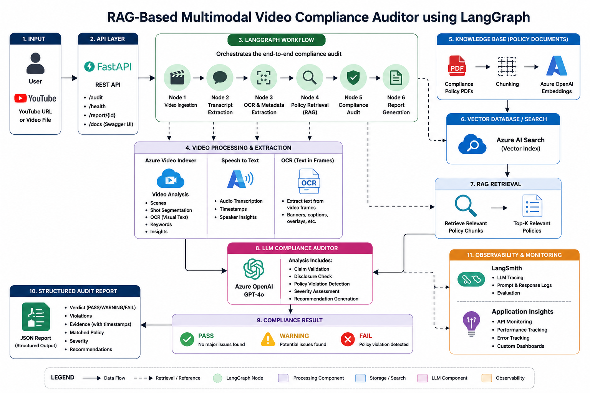
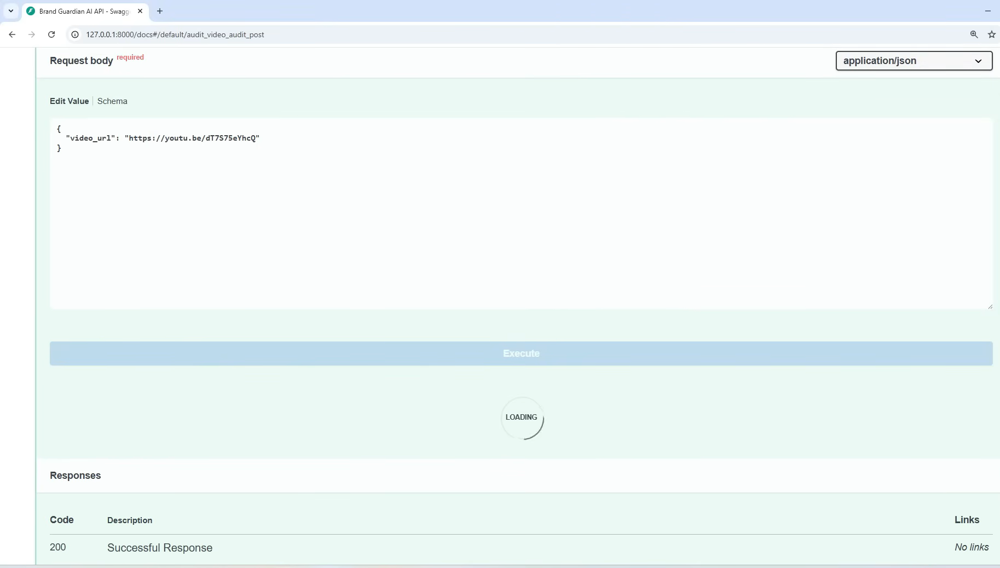
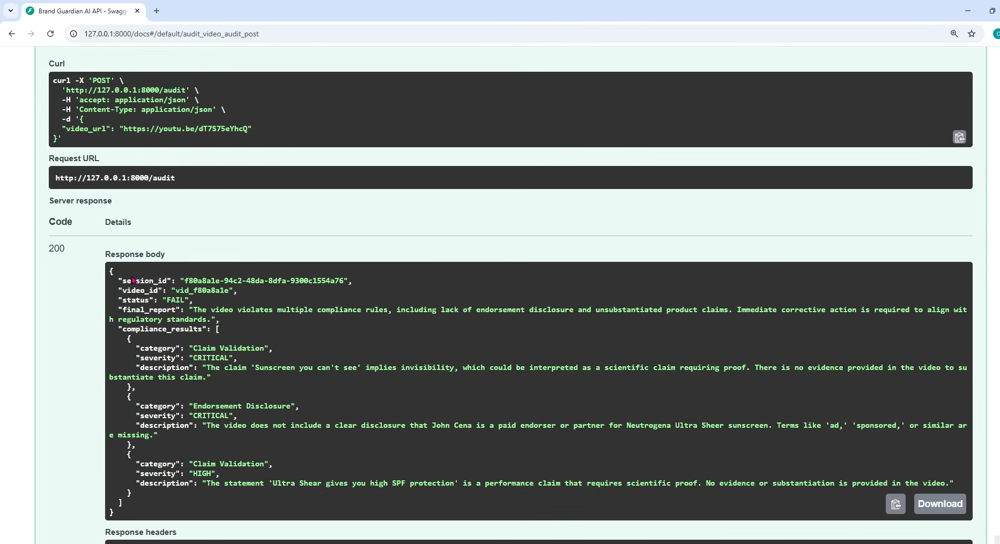

# 🎥 RAG-Based Multimodal Video Compliance Auditor using LangGraph

An enterprise-grade Generative AI system that automatically audits YouTube advertisements, influencer marketing videos, and promotional content against regulatory and compliance policies using Retrieval-Augmented Generation (RAG), LangGraph orchestration, vector search, and Large Language Models (LLMs).

The platform analyzes video content, retrieves relevant compliance rules from policy documents, identifies potential violations, and generates structured audit reports with evidence-backed recommendations.

---

## 🚀 Business Problem

Organizations publish thousands of:

* YouTube Advertisements
* Influencer Marketing Campaigns
* Product Promotion Videos
* Sponsored Content
* Brand Awareness Campaigns

Manual compliance review is:

* Time-consuming
* Expensive
* Difficult to scale
* Prone to human error

This project automates compliance auditing using AI, helping organizations identify misleading claims, missing disclosures, unsupported statements, and policy violations before content is published.

---

## 🏗️ System Architecture



### Architecture Overview

1. User submits a YouTube video URL.
2. FastAPI receives the audit request.
3. LangGraph orchestrates the complete workflow.
4. Video content is analyzed to extract transcript, OCR text, metadata, and timestamps.
5. Compliance policy documents are indexed using embeddings.
6. RAG retrieves the most relevant compliance rules.
7. GPT-4o evaluates the video against policy guidelines.
8. Violations are classified by category and severity.
9. A structured audit report is generated.
10. LangSmith and Application Insights provide observability and monitoring.

---

## 🔄 Workflow Architecture

```text
User Video URL
       │
       ▼
FastAPI Backend
       │
       ▼
LangGraph Workflow
       │
       ▼
Video Processing Layer
       │
 ┌──────────────┬──────────────┐
 ▼                             ▼
Transcript Extraction      OCR Extraction
       │                     │
       └──────────┬──────────┘
                  ▼
      Combined Video Context
                  │
                  ▼
      Compliance Knowledge Base
                  │
                  ▼
      Embeddings + Vector Search
                  │
                  ▼
            RAG Retrieval
                  │
                  ▼
      GPT-4o Compliance Auditor
                  │
                  ▼
      Violation Detection Engine
                  │
                  ▼
        PASS / WARNING / FAIL
                  │
                  ▼
      Structured JSON Report
```

### Workflow Explanation

1. User submits a YouTube video URL.
2. Transcript and OCR content are extracted.
3. Compliance PDFs are converted into embeddings and indexed.
4. Relevant policy chunks are retrieved using vector search.
5. GPT-4o compares video content with retrieved policies.
6. Violations are identified and categorized.
7. The system generates a structured compliance report.
8. Results are returned through FastAPI APIs.

---

## 📸 Project Demonstration

### API Request

The user submits a YouTube URL through the FastAPI endpoint.



---

### Compliance Audit Result

The system generates a structured compliance report highlighting detected violations and recommendations.



---

## 📊 Sample Audit Output

```json
{
  "status": "FAIL",
  "final_report": "The video violates multiple compliance rules.",
  "compliance_results": [
    {
      "category": "Claim Validation",
      "severity": "CRITICAL",
      "description": "Unsupported product claim detected."
    },
    {
      "category": "Endorsement Disclosure",
      "severity": "CRITICAL",
      "description": "Sponsored disclosure missing."
    }
  ]
}
```

---

## ⚙️ Technology Stack

### Backend

* Python
* FastAPI
* Uvicorn

### Generative AI

* GPT-4o
* LangChain
* LangGraph
* Prompt Engineering

### Retrieval Layer

* Retrieval-Augmented Generation (RAG)
* Embeddings
* Vector Search
* Azure AI Search (Architecture Ready)

### Video Intelligence

* Transcript Extraction
* OCR Processing
* Metadata Analysis
* Azure Video Indexer (Architecture Ready)

### Observability

* LangSmith
* Azure Application Insights

### Cloud Services

* Azure Blob Storage (Architecture Ready)
* Azure OpenAI (Architecture Ready)

---

## 🚀 Key Features

* Automated Video Compliance Auditing
* RAG-Based Policy Retrieval
* LangGraph Workflow Orchestration
* OCR and Transcript Processing
* Vector Similarity Search
* Structured JSON Output
* Severity-Based Violation Classification
* Enterprise Monitoring & Observability
* Scalable AI System Design

---

## 🎯 Real-World Use Cases

* Advertisement Compliance Review
* Influencer Marketing Audits
* Brand Safety Monitoring
* Regulatory Compliance Validation
* Product Claim Verification
* Financial Content Auditing
* Healthcare Advertisement Review
* Marketing Campaign Governance

---

## 🧠 Core AI Concepts Demonstrated

* Retrieval-Augmented Generation (RAG)
* Embeddings
* Vector Databases
* Semantic Search
* Prompt Engineering
* Structured Output Generation
* Hallucination Reduction
* Workflow Orchestration
* LLM Evaluation
* AI Observability

---

## 🎯 Skills Demonstrated

* Generative AI Engineering
* Enterprise AI Architecture
* FastAPI Development
* LangGraph Workflows
* Retrieval Systems
* Vector Databases
* AI System Design
* Observability & Monitoring
* API Development
* Cloud-Native AI Design

---

## 📈 Future Enhancements

* React Frontend Dashboard
* Human-in-the-Loop Review System
* Multi-Language Compliance Auditing
* Real-Time Video Monitoring
* Batch Video Processing
* Advanced OCR Pipelines
* Compliance Analytics Dashboard
* Full Azure Cloud Deployment

---

## 👩‍💻 Author

### Pranali Dayanand Misal

**B.Tech – Electronics & Telecommunication Engineering**
Vishwakarma Institute of Information Technology (VIIT), Pune

Aspiring AI Engineer | Generative AI Engineer | Machine Learning Enthusiast

GitHub: https://github.com/Pranali-2027

---

